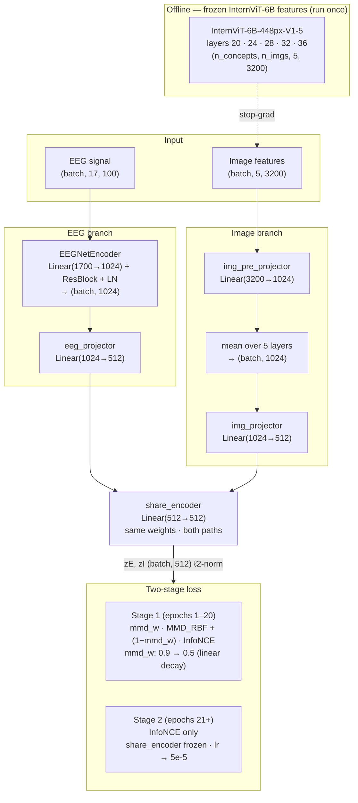
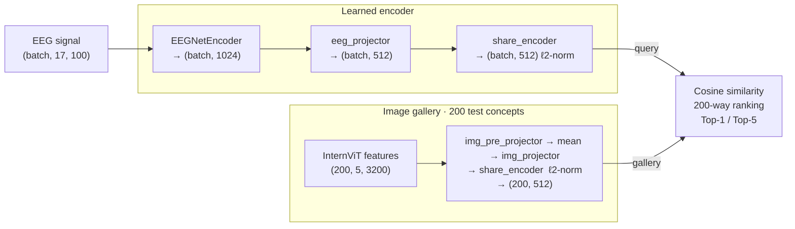

# SUPAEEG — Shared-Encoder EEG–Image Alignment

Zero-shot visual decoding from EEG using the [THINGS-EEG2](https://osf.io/anp5v/)
dataset. SUPAEEG (SAMGA pipeline) aligns EEG embeddings to frozen
[InternViT-6B](https://huggingface.co/OpenGVLab/InternViT-6B-448px-V1-5) features
via a two-stage MMD + InfoNCE objective with a shared encoder for both modalities.

## Model Architecture

### Training Pipeline



### Inference Pipeline



## Project Structure

```text
conf/
└── config.yaml                      # all hyperparameters and Hydra settings
scripts/
└── extract_internvit_features.py    # offline feature extraction + ensure guard
src/
├── dataset.py                       # ThingsEEGDataset
├── utilities.py                     # Config dataclass + training helpers
├── encoders/
│   ├── eegnet_encoder.py            # MLP encoder  (B,17,100) → (B,1024)
│   └── vision_encoder.py            # InternViTFeatureLookup
├── models/
│   └── supaeeg.py                   # SUPAEEG — shared-encoder alignment model
└── trainer/
    ├── loss.py                      # mmd_rbf, info_nce_loss, compute_loss
    └── metrics.py                   # retrieve_all, retrieve_topk
train.py                             # Hydra entry point
data/
└── things_eeg/
    ├── sub-01/ … sub-10/            # preprocessed_eeg_training.npy / _test.npy
    ├── training_images/             # <concept>/<image>.jpg  (1654 concepts × 10)
    ├── test_images/                 # <concept>/<image>.jpg  (200 concepts × 1)
    ├── image_metadata.npy
    └── image_feature/
        └── internvit_multilevel_20_24_28_32_36/
            └── internvit_features.npy   # dict {(concept, img_file): ndarray(n_layers, 3200)} float16
```

## Setup

### Install

```bash
# Install uv (once)
curl -LsSf https://astral.sh/uv/install.sh | sh

# Create virtualenv and install dependencies
uv venv && uv sync

# Install flash-attn and einops separately (require --no-build-isolation)
uv pip install einops flash-attn --no-build-isolation

# Activate (every session)
source .venv/bin/activate
```

### Data

Download EEG data and images:

```bash
sudo apt-get install aria2
bash scripts/download_data.sh
```

This fetches:
- Preprocessed EEG for subjects 1–10 with only 17 channels `data/things_eeg/sub-XX/`
- Image metadata, training images (1654 concepts × 10 images), test images (200 concepts × 1 image)

for 63 channels, run
```bash
bash scripts/download_dataset_full.sh
```
which fetches the full dataset (including 63-channel EEG) but not the vision features (see below).

Manual sources:

| Item | URL |
|------|-----|
| EEG data (preprocessed) | [OSF — anp5v](https://osf.io/anp5v/files/osfstorage) |
| Image metadata | [OSF — y63gw/qkgtf](https://osf.io/y63gw/files/qkgtf) |
| Training images | [OSF — y63gw/3v527](https://osf.io/y63gw/files/3v527) |
| Test images | [OSF — y63gw/znu7b](https://osf.io/y63gw/files/znu7b) |

### InternViT features

InternViT-6B features are extracted locally before training. `train.py` does
this automatically on the first run (no-op if already extracted):

```bash
# Run extraction manually (optional — train.py calls this automatically)
python scripts/extract_internvit_features.py

# Override device or batch size
python scripts/extract_internvit_features.py device=cuda extract_batch_size=32
```
The extracted `.npy` files are written to `internvit_dir` (see config) and are
not re-extracted on subsequent runs.

### Training

All options are controlled via `conf/config.yaml` or Hydra CLI overrides:

```bash
# Single subject — intra-subject protocol (default)
python train.py subject=1

# All subjects, intra protocol
python train.py subject=-1

# Leave-one-subject-out (LOSO) inter-subject protocol
python train.py protocol=inter

# Override hyperparameters
python train.py epochs=60 lr=1e-4 batch_size=256

# Force CPU
DEVICE=cpu python train.py
```

Outputs are written to `outputs/<date>/<time>/` (managed by Hydra):
- `metrics_sub{id:02d}.csv` — per-epoch loss components and retrieval metrics
- `supaeeg_intra_sub{id:02d}.pt` / `supaeeg_loso_sub{id:02d}.pt` — best checkpoint
- `tb_sub{id:02d}/` — TensorBoard event files

## Configuration

All keys live in `conf/config.yaml` and can be overridden as Hydra `key=value` pairs.

### Data & device

| Key | Description | Default |
|-----|-------------|---------|
| `dataset_dir` | THINGS-EEG2 root | `data/things_eeg` |
| `device` | Compute device (`DEVICE` env var overrides) | `cuda` |

### Protocol

| Key | Description | Default |
|-----|-------------|---------|
| `protocol` | `intra` (per-subject) or `inter` (LOSO) | `intra` |
| `subject` | Subject index 1–10; `-1` = all subjects (intra only) | `1` |

### InternViT features

| Key | Description | Default |
|-----|-------------|---------|
| `internvit_model` | HuggingFace model ID | `OpenGVLab/InternViT-6B-448px-V1-5` |
| `internvit_dir` | Output directory for extracted `.npy` files | `data/things_eeg/image_feature/internvit_multilevel_20_24_28_32_36` |
| `layer_ids` | Transformer layers to extract | `[20, 24, 28, 32, 36]` |
| `train_img_dir` | Training image directory | `data/things_eeg/training_images` |
| `test_img_dir` | Test image directory | `data/things_eeg/test_images` |
| `metadata_path` | Image metadata `.npy` | `data/things_eeg/image_metadata.npy` |

### Architecture

| Key | Description | Default |
|-----|-------------|---------|
| `feature_dim` | Shared embedding dimension | `512` |
| `eeg_feature_dim` | EEGNetEncoder output dimension | `1024` |
| `image_input_dim` | InternViT feature dimension per layer | `3200` |
| `image_mid_dim` | Image pre-projector hidden dimension | `1024` |

### Training

| Key | Description | Default |
|-----|-------------|---------|
| `epochs` | Total training epochs | `60` |
| `batch_size` | Batch size | `512` |
| `eval_every` | Evaluate every N epochs | `5` |
| `lr` | Initial learning rate | `1e-4` |
| `weight_decay` | AdamW weight decay | `1e-4` |
| `grad_clip` | Max gradient norm | `1.0` |
| `stage1_epochs` | Epochs in MMD+InfoNCE stage | `20` |
| `stage2_lr` | Learning rate after stage-1 | `5e-5` |
| `mmd_start` | MMD weight at epoch 1 | `0.9` |
| `mmd_end` | MMD weight at end of stage 1 | `0.5` |

## Implementation References

| Component | File | Role |
|-----------|------|------|
| Hydra entry point | `train.py` | Protocol dispatch, feature guard, training loop |
| Config dataclass | `src/utilities.py` | `Config`; `make_model`, `train_one_epoch`, `evaluate` |
| Hyperparameter reference | `conf/config.yaml` | YAML source of all defaults |
| EEG encoder | `src/encoders/eegnet_encoder.py` | Flatten → Linear(1700,1024) → ResBlock → LayerNorm |
| Image feature lookup | `src/encoders/vision_encoder.py` | `InternViTFeatureLookup` — loads `.npy` per layer |
| Full model | `src/models/supaeeg.py` | `SUPAEEG` — shared-encoder alignment |
| Loss functions | `src/trainer/loss.py` | `mmd_rbf`, `info_nce_loss`, `compute_loss` |
| Retrieval eval | `src/trainer/metrics.py` | `retrieve_all` — Top-1 / Top-5 diagonal retrieval |
| Feature extraction | `scripts/extract_internvit_features.py` | Offline InternViT feature extraction + `ensure_internvit_features` guard |

## Dataset Explorer

Open `viz_thingeeg.ipynb` in Jupyter to inspect EEG samples, image concepts, and
feature distributions interactively.
