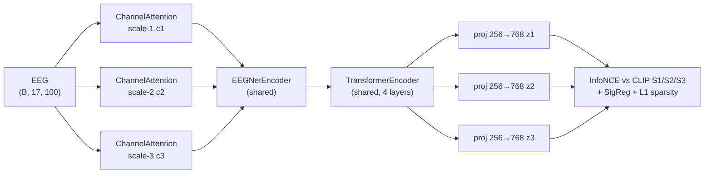

# SUPAEEG — Scale-Unified Parieto-occipital Architecture

Zero-shot visual decoding from EEG using the [THINGS-EEG2](https://osf.io/anp5v/) dataset.
SUPAEEG aligns multi-scale EEG embeddings to frozen CLIP features via contrastive learning.

## How it works



Three learned scale prototype vectors (c1, c2, c3) each gate the EEG channels via soft
attention, then a shared EEGNet tokeniser and transformer encoder produce per-scale
embeddings that are aligned to the corresponding CLIP depth level (S1 early / S2 mid /
S3 late). At inference, `embed()` concatenates and ℓ2-normalises [z1, z2, z3] into a
2304-d descriptor.

## Project Structure

```text
conf/
└── model/
    └── supaeeg.yaml          # hyperparameter reference
src/
├── utilities.py              # Config / EncoderConfig dataclasses + training helpers
├── encoders/
│   ├── eegnet_encoder.py     # EEGNet spatiotemporal tokeniser  (B,17,100) → (B,N_t,256)
│   └── visual_encoder.py     # Frozen CLIP/I-JEPA encoder + VisualFeatureLookup
├── models/
│   └── supaeeg.py            # SUPAEEG, MultiScaleEncoder, ChannelAttention
└── trainer/
    ├── loss.py               # info_nce_loss, sigreg_loss, l1_sparsity_loss, compute_loss
    └── metrics.py            # retrieve_all, retrieve_topk
train.py                      # Typer CLI entrypoint
data/
├── things_eeg/
│   ├── sub-01/ … sub-10/     # preprocessed_eeg_training.npy / _test.npy
│   ├── training_images/      # <concept>/<image>.jpg
│   ├── test_images/          # <concept>/<image>.jpg
│   └── image_metadata.npy
└── vision_encoder/
    └── clip/
        └── visual_features_clip.pt   # pre-extracted CLIP S1/S2/S3 lookup table
```

## Setup

### Install

```bash
# Install uv (once)
curl -LsSf https://astral.sh/uv/install.sh | sh

# Create virtualenv and install dependencies
uv venv && uv sync

# Activate (every session)
source .venv/bin/activate
```

### Data

Download filtered EEG data and pre-extracted CLIP features:

```bash
bash scripts/download_data.sh
```

This fetches:
- Filtered EEG for subjects 1–10 → `data/things_eeg/sub-XX/`
- Image metadata, training images, test images
- CLIP visual feature bank → `data/vision_encoder/clip/visual_features_clip.pt`

Manual sources:

| Item | URL |
|------|-----|
| EEG data (filtered) | [OSF — anp5v](https://osf.io/anp5v/files/osfstorage) |
| Image metadata | [OSF — y63gw/qkgtf](https://osf.io/y63gw/files/qkgtf) |
| Training images | [OSF — y63gw/3v527](https://osf.io/y63gw/files/3v527) |
| Test images | [OSF — y63gw/znu7b](https://osf.io/y63gw/files/znu7b) |
| CLIP features | [Tsinghua Cloud](https://cloud.tsinghua.edu.cn/f/7c0d0012439b49c5a512/?dl=1) |

> If `visual_features_clip.pt` is absent, `train.py` will extract it
> automatically using the frozen CLIP encoder before training begins.

## Training

```bash
# Single subject — intra-subject protocol (default)
python train.py --subject 1

# All subjects, intra protocol
python train.py --subject -1

# Leave-one-subject-out (LOSO) inter-subject protocol
python train.py --protocol inter

# Override hyperparameters
python train.py --epochs 50 --lr 1e-4 --batch-size 128

# Custom encoder depth taps
python train.py --encoder-s1-layer 2 --encoder-s2-layer 6 --encoder-s3-layer 10

# Force CPU
DEVICE=cpu python train.py

# Show all options
python train.py --help
```

Outputs (checkpoints, logs) are written to `outputs/supaeeg/`. The best checkpoint
(by Top-1 retrieval accuracy) is saved per subject: `supaeeg_intra_sub{id:02d}.pt`
for intra-subject runs and `supaeeg_loso_sub{id:02d}.pt` for leave-one-subject-out
runs.

## Configuration

All options can be passed as CLI flags to `train.py`. The table below lists every
flag with its default value.

### Data & device

| Flag | Description | Default |
|------|-------------|-------|
| `--dataset-dir` | THINGS-EEG2 root | `data/things_eeg` |
| `--feature-path` | Visual feature bank `.pt` file | `data/vision_encoder/clip/visual_features_clip.pt` |
| `--device` | Compute device (`DEVICE` env var overrides) | `cuda` |

### Protocol

| Flag | Description | Default |
|------|-------------|-------|
| `--protocol` | `intra` (per-subject) or `inter` (LOSO) | `intra` |
| `--subject` | Subject index 1–10; `-1` = all subjects (intra only) | `1` |

### Visual encoder

| Flag | Description | Default |
|------|-------------|-------|
| `--encoder-type` | `clip` or `ijepa` | `clip` |
| `--encoder-model-name` | HuggingFace model identifier | `openai/clip-vit-base-patch32` |
| `--encoder-s1-layer` | Transformer layer index for S1 (early features) | `3` |
| `--encoder-s2-layer` | Transformer layer index for S2 (mid features) | `7` |
| `--encoder-s3-layer` | Transformer layer index for S3 (late features) | `11` |

### Training

| Flag | Description | Default |
|------|-------------|-------|
| `--epochs` | Training epochs | `100` |
| `--batch-size` | Batch size | `256` |
| `--eval-every` | Evaluate every N epochs | `5` |
| `--lambda-reg` | Gaussian regulariser weight | `0.1` |
| `--beta-l1` | Channel-attention L1 sparsity weight | `0.01` |
| `--tau` | InfoNCE temperature | `0.07` |
| `--d-model` | Token embedding dim | `256` |
| `--nhead` | Transformer attention heads | `8` |
| `--num-layers` | Transformer depth | `4` |
| `--dim-feedforward` | FFN hidden size | `512` |
| `--dropout` | Dropout | `0.1` |
| `--lr` | Learning rate | `3e-4` |
| `--weight-decay` | Weight decay | `1e-4` |
| `--checkpoint-dir` | Checkpoint output directory | `outputs/supaeeg` |

## Implementation References

| Component | File | Role |
|-----------|------|------|
| CLI entry | `train.py` | Typer entry, protocol dispatch, feature extraction |
| Config dataclasses | `src/utilities.py` | `Config`, `EncoderConfig`; training helpers |
| Hyperparameter reference | `conf/model/supaeeg.yaml` | YAML mirror of all defaults |
| EEG tokeniser | `src/encoders/eegnet_encoder.py` | Temporal → depthwise → separable conv → token sequence |
| Visual targets | `src/encoders/visual_encoder.py` | Frozen CLIP/I-JEPA encoder + `VisualFeatureLookup` |
| Full model | `src/models/supaeeg.py` | `SUPAEEG`, `MultiScaleEncoder`, `ChannelAttention` |
| Loss functions | `src/trainer/loss.py` | `compute_loss`, `info_nce_loss`, `sigreg_loss`, `l1_sparsity_loss` |
| Retrieval eval | `src/trainer/metrics.py` | `retrieve_all` — Top-1 / Top-5 diagonal retrieval |

## Dataset Explorer

Open `viz_thingseeg.ipynb` in Jupyter to inspect EEG samples, image concepts, and
feature distributions interactively.
