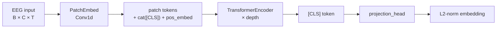
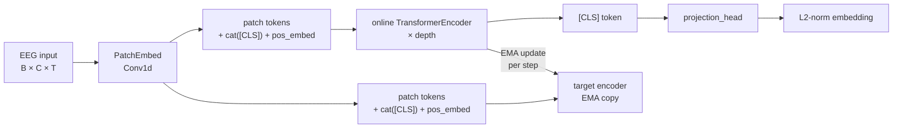
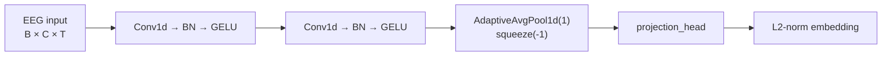

# Time-Series Project

Decoding visual perception from EEG signals recorded while subjects viewed ImageNet images. This project supports two tasks:

- **Object Classification**: classify viewed object categories from EEG
- **Image Generation**: reconstruct viewed images from EEG via Stable Diffusion

## Models

| Model | Config | Pipeline | Notes |
|-------|--------|----------|-------|
| EEGNet | `eegnet` | EEG → Conv2D → logits | Baseline CNN |
| MLP | `mlp` | DE features → FC layers → logits | Baseline, frequency-domain |
| RGNN | `rgnn` | EEG → Graph NN → logits | Baseline, graph-based |
| SVM / RF / KNN / DT / Ridge | `svm` … | DE features → sklearn | Classical ML baselines |
| Semantic | `semantic` | EEG backbone → L2 embedding | Triplet metric learning |
| MLPMapper | `mlp_sd` | DE features → MLP → CLIP → Stable Diffusion | Generation only |

> **Adding your own model:** Create a file in `src/model/`, add a Hydra config in `configs/model/`, and register it in `object_classification.py`.

## Project Structure

```
configs/
├── config.yaml               # Shared defaults (dataset, output, diffusion)
└── model/                    # Per-model hyperparameters
    ├── eegnet.yaml
    ├── mlp.yaml / mlp_sd.yaml
    ├── rgnn.yaml
    ├── semantic.yaml
    └── svm.yaml / rf.yaml / knn.yaml / dt.yaml / ridge.yaml
src/
├── utilities.py              # Shared constants, helpers, device detection
├── dataset.py                # EEGImageNetDataset (PyTorch Dataset)
├── object_classification.py  # Train & evaluate EEG classifiers (entrypoint)
├── image_generation.py       # Train MLP mapper (EEG → CLIP embeddings)
├── gen_eval.py               # Generate images from EEG via Stable Diffusion
├── gen_img_list.py           # Export image filename / label reference lists
├── preprocessing/
│   ├── blip_clip.py          # BLIP captioning → CLIP text embeddings (one-time)
│   ├── de_feat_cal.py        # Differential-entropy (DE) feature extraction
│   └── semantic_knn.py       # CLIP+KNN class neighbor graph (one-time, cached)
├── trainer/
│   ├── train.py              # Training loops (classification, semantic, generation)
│   ├── inference.py          # Prediction-only loops
│   └── metrics.py            # Loss functions and evaluation helpers
└── model/
    ├── eegnet.py             # EEGNet
    ├── mlp.py                # MLP classifier
    ├── mlp_sd.py             # MLP mapper to CLIP embedding space
    ├── rgnn.py               # Regularized Graph Neural Network
    ├── semantic.py           # SemanticModel (switchable backbone, triplet loss)
    └── simple_model.py       # Sklearn wrappers (SVM, RF, KNN, DT, Ridge)
scripts/
└── merge_dataset.py          # Merge split .pth dataset files
data/
├── EEG-ImageNet.pth          # Merged EEG dataset
├── imageNet_images/          # Stimulus images by synset (generation task only)
└── mode/                     # EEG montage files
```

## Prerequisites

1. Install [uv](https://github.com/astral-sh/uv):
   ```bash
   curl -LsSf https://astral.sh/uv/install.sh | sh
   ```

2. Download the EEG-ImageNet dataset from [Tsinghua Cloud](https://cloud.tsinghua.edu.cn/d/d812f7d1fc474b14bbd0/) and place the `.pth` files in `data/`.

3. *(Generation task only)* Download ImageNet images and place them under `data/imageNet_images/`.

## Installation

```bash
uv venv && uv sync
python scripts/merge_dataset.py data/EEG-ImageNet_1.pth data/EEG-ImageNet_2.pth data/EEG-ImageNet.pth
```

Activate the environment in each new terminal:
```bash
source .venv/bin/activate
```

## Usage

All scripts use [Hydra](https://hydra.cc/) for configuration. Defaults live in `configs/config.yaml` and per-model settings in `configs/model/`. Override any value from the CLI:

| Key | Description | Default |
|-----|-------------|---------|
| `dataset_dir` | Dataset directory | `data/` |
| `granularity` | `coarse`, `fine0`–`fine4`, or `all` | `coarse` |
| `model` | Model config group | `eegnet` |
| `batch_size` | Batch size | `40` |
| `subject` | Target subject (RealID), 0–7 | `0` |
| `metric` | Evaluation paradigm: `wt`, `ct`, or `cp` | `wt` |
| `output_dir` | Output directory | `outputs/` |
| `pretrained_model` | Pretrained model filename | `null` |

Training hyperparameters (lr, epochs, optimizer, …) are set per-model in `configs/model/<name>.yaml` and can also be overridden:

```bash
python src/object_classification.py model.optimizer.lr=0.005 model.epochs=500
```

### Evaluation Paradigms

The dataset contains 16 raw subject IDs (0–15) mapping to 8 real participants recorded in two stages ~7 days apart:

| Raw subject | RealID (`subject % 8`) | Stage |
|:-----------:|:----------------------:|:-----:|
| 0–7         | 0–7                    | 1     |
| 8–15        | 0–7                    | 2     |

| Paradigm | `metric` | Train set | Test set |
|----------|:--------:|-----------|----------|
| **Within-Time** | `wt` | Target subject, Stage 2, first 30 labels | Target subject, Stage 2, remaining 20 labels |
| **Cross-Time** | `ct` | Target subject, Stage 1 | Target subject, Stage 2 |
| **Cross-Participant** | `cp` | All *other* subjects, Stage 1 | Target subject, Stage 1 |

### Object Classification

#### Baseline Models

```bash
# Default (EEGNet, within-time, subject 0)
python src/object_classification.py

# Specify model, subject, evaluation paradigm
python src/object_classification.py model=rgnn subject=3 metric=ct

# Override training hyperparameters
python src/object_classification.py model.optimizer.lr=0.005 model.epochs=100

# Classical ML baseline
python src/object_classification.py model=svm
```

#### Semantic Model

`SemanticModel` trains an EEG encoder with a batch-hard **triplet loss** — no cross-entropy. The backbone is switchable via `model.backbone`.

##### Architecture

**transformer**



**jepa**



**nn**



##### Usage

```bash
# Default backbone (transformer)
python src/object_classification.py model=semantic

# Switch backbone
python src/object_classification.py model=semantic model.backbone=transformer
python src/object_classification.py model=semantic model.backbone=jepa
python src/object_classification.py model=semantic model.backbone=nn

# Tune triplet margin
python src/object_classification.py model=semantic model.triplet_margin=0.25
```

##### CLIP-KNN Semantic Neighbors

Optionally expand triplet positives/negatives using CLIP-space class similarity. The neighbor graph is built once and cached as JSON.

```bash
# Build and cache the class neighbor graph
python src/preprocessing/semantic_knn.py model=semantic model.semantic_knn_k=4 model.semantic_neg_k=4

# Train with semantic neighbors
python src/object_classification.py model=semantic model.semantic_knn_path=data/semantic_knn_coarse.json

# Force rebuild if needed
python src/preprocessing/semantic_knn.py model=semantic model.semantic_knn_overwrite=true
```


### Image Generation

```bash
# Step 1: Generate CLIP embeddings (one-time)
python src/preprocessing/blip_clip.py granularity=all

# Step 2: Train EEG → CLIP mapper
python src/image_generation.py model=mlp_sd

# Step 3: Generate images from EEG
python src/gen_eval.py model=mlp_sd pretrained_model=mlpsd_s0_0.pth
```

### Visualization

Open `viz.ipynb` in Jupyter to explore the EEG data interactively.