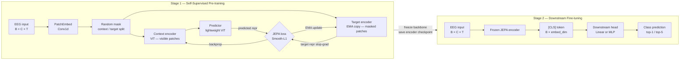
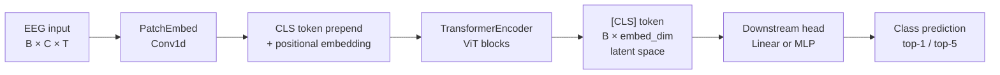
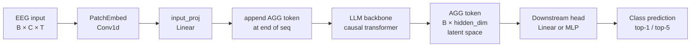

# Time-Series Project

Decoding visual perception from EEG signals recorded while subjects viewed ImageNet images. This project supports two tasks:

- **Object Classification** : classify viewed object categories from EEG
- **Image Generation** : reconstruct viewed images from EEG via Stable Diffusion

## Models

The current implementation follows the [CROSSPT-EEG](https://doi.org/10.48550/arXiv.2406.07151) pipeline as a baseline and adds several encoder architectures for exploration:

| Model | Config | Pipeline | Notes |
|-------|--------|----------|-------|
| EEGNet | `eegnet` | EEG → Conv2D → logits | Baseline CNN |
| MLP | `mlp` | DE features → FC layers → logits | Baseline, frequency-domain |
| RGNN | `rgnn` | EEG → Graph NN → logits | Baseline, graph-based |
| SVM / RF / KNN / DT / Ridge | `svm` … | DE features → sklearn | Baseline, classical ML |
| EEG-JEPA | `jepa` | EEG → masked ViT pretrain → linear probe | Self-supervised |
| EEG Transformer | `eeg_transformer` | EEG → ViT encoder → downstream head | Supervised, decoupled |
| LLM Encoder | `llm_encoder` | EEG patches → LLM backbone → downstream head | Pre-trained LLM + LoRA |
| Semantic Triplet | `semantic_triplet` | EEG backbone → Transformer → JEPA EMA target + triplet | Metric + representation learning |
| MLPMapper | `mlp_sd` | DE features → MLP → CLIP → Stable Diffusion | Generation only |

> **Adding your own model:** Create a file in `src/model/`, add a Hydra config in `configs/model/`, and register it in `object_classification.py`. The shared dataset, feature extraction, and evaluation infrastructure are reusable.

## Project Structure

```
configs/
├── config.yaml               # Shared defaults (dataset, output, diffusion, blip)
└── model/                    # Per-model training hyperparameters
    ├── eegnet.yaml
    ├── mlp.yaml
    ├── rgnn.yaml
    ├── mlp_sd.yaml
    └── svm.yaml / rf.yaml / knn.yaml / dt.yaml / ridge.yaml
src/
├── utilities.py              # Shared constants, helpers, device detection, benchmark splits
├── dataset.py                # EEGImageNetDataset + CrossPTEEGSyntheticDataset (PyTorch Datasets)
├── object_classification.py  # Train & evaluate EEG classifiers (single entrypoint)
├── image_generation.py       # Train MLP mapper (EEG → CLIP embeddings)
├── gen_eval.py               # Generate images from EEG via Stable Diffusion
├── gen_img_list.py           # Export image filename / label reference lists
├── preprocessing/
│   ├── blip_clip.py          # BLIP captioning → CLIP text embeddings (one-time)
│   └── de_feat_cal.py        # Differential-entropy (DE) feature extraction
├── trainer/
│   ├── train.py              # Reusable training loops (classification & generation)
│   ├── inference.py          # Prediction-only loops
│   └── metrics.py            # Label mapping & evaluation helpers
└── model/
    ├── eegnet.py             # [Baseline] EEGNet
    ├── mlp.py                # [Baseline] MLP classifier
    ├── mlp_sd.py             # [Baseline] MLP mapper to CLIP embedding space
    ├── rgnn.py               # [Baseline] Regularized Graph Neural Network
    ├── simple_model.py       # [Baseline] Sklearn (SVM, RF, KNN, DT, Ridge)
scripts/
└── merge_dataset.py          # Merge split .pth dataset files
data/
├── EEG-ImageNet.pth          # Merged EEG dataset
├── imageNet_images/          # Stimulus images by synset (generation task only)
└── mode/                     # EEG montage files
```

## Prerequisites

1. Install [uv](https://github.com/astral-sh/uv):
   ```bash
   curl -LsSf https://astral.sh/uv/install.sh | sh
   ```

2. Download the EEG-ImageNet dataset from [Tsinghua Cloud](https://cloud.tsinghua.edu.cn/d/d812f7d1fc474b14bbd0/) and place the `.pth` files in `data/`.

3. *(Generation task only)* Download ImageNet images and place them under `data/imageNet_images/`.

## Installation

```bash
uv venv && uv sync
python scripts/merge_dataset.py data/EEG-ImageNet_1.pth data/EEG-ImageNet_2.pth data/EEG-ImageNet.pth
```

Activate the environment in each new terminal:
```bash
source .venv/bin/activate
```

## Usage

All scripts use [Hydra](https://hydra.cc/) for configuration. Defaults live in `configs/config.yaml` and per-model settings in `configs/model/`. Override any value from the CLI:

| Key | Description | Default |
|-----|-------------|---------|
| `dataset_dir` | Dataset directory | `data/` |
| `granularity` | `coarse`, `fine0`–`fine4`, or `all` | `coarse` |
| `model` | Model config group (`eegnet`, `mlp`, `rgnn`, `svm`, `mlp_sd`, …) | `eegnet` |
| `batch_size` | Batch size | `40` |
| `subject` | Target subject (RealID), 0–7 | `0` |
| `metric` | Evaluation paradigm: `wt`, `ct`, or `cp` | `wt` |
| `output_dir` | Output directory | `outputs/` |
| `pretrained_model` | Pretrained model filename | `null` |

Training hyperparameters (lr, epochs, optimizer, …) are set per-model in `configs/model/<name>.yaml` and can also be overridden:

```bash
python src/object_classification.py model.optimizer.lr=0.005 model.epochs=500
```

### Evaluation Paradigms

The dataset contains data from 16 raw subject IDs (0–15), which correspond to 8 real participants each recorded in two stages separated by ~7 days:

| Raw subject | RealID (`subject % 8`) | Stage |
|:-----------:|:----------------------:|:-----:|
| 0–7         | 0–7                    | 1     |
| 8–15        | 0–7                    | 2     |

Three evaluation paradigms are supported via `metric=`:

| Paradigm | `metric` | Train set | Test set |
|----------|:--------:|-----------|----------|
| **Within-Time** | `wt` | Target subject, Stage 2, first 30 labels | Target subject, Stage 2, remaining 20 labels |
| **Cross-Time** | `ct` | Target subject, Stage 1 | Target subject, Stage 2 |
| **Cross-Participant** | `cp` | All *other* subjects, Stage 1 | Target subject, Stage 1 |

### Object Classification

#### EEG-JEPA

JEPA first pre-trains a Transformer encoder via masked-patch prediction in latent space, then fine-tunes a linear classifier on the learned `[CLS]` representation. Training utilities (`ema_decay_schedule`, `topk_correct`, `jepa_evaluate`, `load_jepa_checkpoint`) live alongside the model in `src/model/jepa.py`.



`object_classification.py` is the single entrypoint for both real and synthetic data. Pass `synthetic=true` to use the built-in synthetic CrossPT-EEG dataset instead of loading `EEG-ImageNet.pth`:

```bash
# Synthetic end-to-end run (pretrain + linear probe, top-1/top-5 eval)
python src/object_classification.py model=jepa synthetic=true granularity=all model.seq_len=1000

# Quick smoke test on synthetic data
python src/object_classification.py model=jepa synthetic=true model.seq_len=1000 \
    model.pretrain_epochs=1 model.epochs=1 samples_per_subject=80 batch_size=32

# Task variants
python src/object_classification.py model=jepa synthetic=true model.seq_len=1000 granularity=coarse
python src/object_classification.py model=jepa synthetic=true model.seq_len=1000 granularity=fine fine_group=3
```

#### EEG Transformer

`EEGTransformer` uses a **fully-supervised ViT-style encoder** — no masked pre-training. EEG patches are encoded by a Transformer, and a separate downstream head classifies from the `[CLS]` token. Shares the same decoupled pipeline as JEPA.



```bash
# Linear probe (default — freeze encoder, train head only)
python src/object_classification.py model=eeg_transformer

# End-to-end fine-tuning
python src/object_classification.py model=eeg_transformer model.linear_probe=false

# MLP downstream head
python src/object_classification.py model=eeg_transformer model.downstream.type=mlp model.downstream.hidden_dims=[256,128]
```

#### LLM Encoder

`LLMEEGEncoder` projects EEG patches into a pre-trained causal LLM's hidden space (default: `Qwen/Qwen2.5-0.5B`). A learnable aggregation token appended at the end summarises the full sequence under causal attention. The backbone can be swapped by changing one config line.



Four training modes are available:

| Mode | `linear_probe` | `lora` | `fine_tune_llm` | What trains | Typical params |
|------|:-:|:-:|:-:|---|---|
| Linear probe | `true` | — | — | head only (features pre-extracted) | ~0.1% |
| Frozen LLM | `false` | `false` | `false` | frontend + head | ~1% |
| **LoRA** | `false` | `true` | — | LoRA matrices + frontend + head | ~1–2% |
| Full fine-tune | `false` | `false` | `true` | everything | 100% |

```bash
# Linear probe (default)
python src/object_classification.py model=llm_encoder

# Frozen LLM — only EEG frontend adapts
python src/object_classification.py model=llm_encoder model.linear_probe=false

# LoRA (recommended for backbone adaptation)
python src/object_classification.py model=llm_encoder model.linear_probe=false model.lora=true

# LoRA with larger rank
python src/object_classification.py model=llm_encoder model.linear_probe=false model.lora=true model.lora_r=16 model.lora_alpha=32

# Different backbone (any HuggingFace AutoModel)
python src/object_classification.py model=llm_encoder model.pretrained_name=meta-llama/Llama-3.2-1B
```

#### Baseline for training and evaluating the baseline classification models:

```bash
# Deep model (defaults to eegnet, within-time)
python src/object_classification.py

# Specify model, subject, and evaluation paradigm
python src/object_classification.py model=rgnn subject=3 metric=ct

# Change training hyperparameters
python src/object_classification.py model.optimizer.lr=0.005 model.epochs=100

# Sklearn baseline
python src/object_classification.py model=svm

# Semantic backbone + Transformer + JEPA + triplet loss
python src/object_classification.py model=semantic_triplet

# Tune semantic objective weights
python src/object_classification.py model=semantic_triplet model.triplet_weight=0.7 model.jepa_weight=0.3 model.triplet_margin=0.25
```


### Image Generation (Baseline)

```bash
# Step 1: Generate CLIP embeddings (one-time)
python src/preprocessing/blip_clip.py granularity=all

# Step 2: Train EEG → CLIP mapper
python src/image_generation.py model=mlp_sd

# Step 3: Generate images from EEG
python src/gen_eval.py model=mlp_sd pretrained_model=mlpsd_s0_0.pth
```

### Visualization

Open `viz.ipynb` in Jupyter to explore the EEG data interactively.