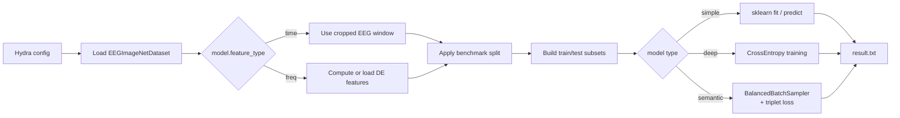
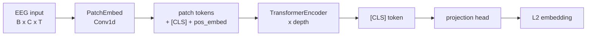
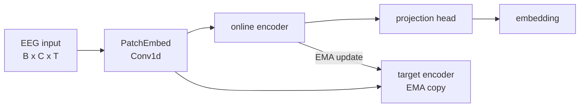
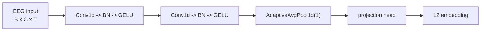

# Time-Series Project

Decode visual perception from EEG recorded while subjects view ImageNet images. The repository is currently documented around one primary workflow:

- **Object classification**: predict the viewed category from EEG.

## Overview

| Task | Entrypoint | Output |
|------|------------|--------|
| Object classification | `src/object_classification.py` | best checkpoint + `result.txt` |

All experiment runs are managed with [Hydra](https://hydra.cc/). By default, outputs are written to:

```text
outputs/<model>/<metric>/<timestamp>/
```

## Models

| Model | Config | Feature type | Objective | Notes |
|-------|--------|--------------|-----------|-------|
| EEGNet | `eegnet` | time | cross-entropy | Conv baseline on cropped EEG windows |
| MLP | `mlp` | freq | cross-entropy | DE features, fully connected classifier |
| RGNN | `rgnn` | freq | cross-entropy | Graph neural network over EEG channels |
| SVM / RF / KNN / DT / Ridge | `svm` … | freq | sklearn fit/predict | Classical baselines on DE features |
| Semantic | `semantic` | time | triplet loss | Retrieval-style embedding model |

> **Adding a new model:** add the implementation in `src/model/`, create `configs/model/<name>.yaml`, and register it in `src/object_classification.py`.

## Project Structure

```text
configs/
├── config.yaml               # Shared defaults: dataset, subject, metric, outputs
└── model/                    # Per-model hyperparameters
    ├── eegnet.yaml
    ├── mlp.yaml
    ├── mlp_sd.yaml
    ├── rgnn.yaml
    ├── semantic.yaml
    └── svm.yaml / rf.yaml / knn.yaml / dt.yaml / ridge.yaml
src/
├── dataset.py                # EEGImageNetDataset and BalancedBatchSampler
├── object_classification.py  # Classification training entrypoint
├── utilities.py              # Splits, device helpers, optimizer builder
├── preprocessing/
│   └── de_feat_cal.py        # Differential entropy (DE) feature extraction
├── trainer/
│   ├── loss.py               # Training losses
│   ├── train.py              # Training loops
│   ├── inference.py          # Inference-only helpers
│   └── metrics.py            # Evaluation helpers
└── model/
    ├── eegnet.py
    ├── mlp.py
    ├── rgnn.py
    ├── semantic.py
    └── simple_model.py
scripts/
└── merge_dataset.py          # Merge split dataset parts into EEG-ImageNet.pth
data/
├── EEG-ImageNet.pth          # Merged dataset used by the training scripts
├── de_feat/                  # Cached DE features
└── mode/                     # EEG montage files for RGNN
```

## Setup

### Prerequisites

1. Install [uv](https://github.com/astral-sh/uv):

```bash
curl -LsSf https://astral.sh/uv/install.sh | sh
```

2. Download the EEG-ImageNet dataset from [Tsinghua Cloud](https://cloud.tsinghua.edu.cn/d/d812f7d1fc474b14bbd0/) and place the `.pth` files under `data/`.

### Installation

```bash
uv venv && uv sync
python scripts/merge_dataset.py data/EEG-ImageNet_1.pth data/EEG-ImageNet_2.pth data/EEG-ImageNet.pth
source .venv/bin/activate
```

## Configuration

Global defaults live in `configs/config.yaml`. Model-specific defaults live in `configs/model/<name>.yaml`.

| Key | Description | Default |
|-----|-------------|---------|
| `dataset_dir` | Dataset directory | `data/` |
| `granularity` | `coarse`, `fine`, `fine0`-`fine4`, or `all` | `fine` |
| `model` | Hydra model group | `eegnet` |
| `batch_size` | Batch size | `40` |
| `subject` | Raw subject id used by the current run | `0` |
| `metric` | Benchmark split mode | `wt` |
| `output_dir` | Root output directory | `outputs/` |
| `pretrained_model` | Optional checkpoint filename | `null` |

Override any value from the CLI:

```bash
python src/object_classification.py model=mlp model.optimizer.lr=0.0005 model.epochs=300
```

## Benchmark Splits

The raw dataset contains 16 subject ids, corresponding to 8 real participants recorded in two sessions.

| Raw subject | RealID (`subject % 8`) | Stage |
|:-----------:|:----------------------:|:-----:|
| 0-7         | 0-7                    | 1     |
| 8-15        | 0-7                    | 2     |

Current implementation status:

| Paradigm | `metric` | Status | Behavior |
|----------|:--------:|--------|----------|
| Within-Time | `wt` | implemented | exact upstream 30/20 split inside each 50-sample block |
| Cross-Time | `ct` | not implemented | placeholder in code |
| Cross-Participant | `cp` | not implemented | placeholder in code |

For `wt`, the dataset is first filtered by `subject` and `granularity`, then split with:

```text
train: i % 50 < 30
test:  i % 50 >= 30
```

## Training Pipelines

### Object Classification Pipeline

The classification entrypoint is `src/object_classification.py`. The high-level flow is:



Detailed steps:

1. `EEGImageNetDataset` loads `EEG-ImageNet.pth`, filters by `subject` and `granularity`, and returns dataset-local contiguous class ids.
2. If `model.feature_type=freq`, DE features are computed or loaded from cache. If `model.feature_type=time`, the cropped EEG window is used directly.
3. `utilities.get_benchmark_split` builds train/test indices for the selected metric.
4. `torch.utils.data.Subset` objects are created over a dataset that already emits contiguous labels.
5. Training dispatch depends on `model.type` and `model.name`.
6. The best checkpoint and summary metrics are written to the Hydra run directory.

### Model-Specific Training Behavior

#### Classical Baselines

Models: `svm`, `rf`, `knn`, `dt`, `ridge`

1. Frequency-domain DE features are flattened.
2. The sklearn wrapper in `src/model/simple_model.py` is fit on the train split.
3. Evaluation is top-1 accuracy on the test split.

#### Deep Classifiers

Models: `eegnet`, `mlp`, `rgnn`

1. A PyTorch `DataLoader` is built for train and test subsets.
2. The model is optimized with cross-entropy.
3. Each epoch evaluates on the test split with top-1, top-5, and average loss.
4. The checkpoint with the best top-1 score is saved.

Feature routing:

- `eegnet`: time-domain EEG window
- `mlp`: DE features
- `rgnn`: DE features

#### Semantic Training

`SemanticModel` does not train a softmax classifier. It learns an embedding with batch-hard triplet loss.

1. The dataset stays in time-domain mode.
2. `BalancedBatchSampler` builds batches containing multiple examples from multiple classes.
3. The model outputs L2-normalized embeddings.
4. Training uses batch-hard triplet loss.
5. Evaluation builds class prototypes from the eval split and measures retrieval-style top-1 and top-5 accuracy.

The triplet objective is implemented in `src/trainer/loss.py`, while evaluation logic lives in `src/trainer/metrics.py`.

Backbone options are selected with `model.backbone`.

**transformer**: patch-based encoder using a `[CLS]` token



**jepa**: transformer backbone plus EMA-updated target encoder



**nn**: lightweight Conv1d encoder



## Usage

### Object Classification

#### Baseline Models

```bash
# Default run: EEGNet, subject 0, within-time split
python src/object_classification.py

# MLP baseline on DE features
python src/object_classification.py model=mlp

# RGNN baseline
python src/object_classification.py model=rgnn

# Classical ML baseline
python src/object_classification.py model=svm

# Override optimizer or epoch count
python src/object_classification.py model=mlp model.optimizer.lr=0.0005 model.epochs=300
```

#### Semantic Model

```bash
# Default semantic backbone: transformer
python src/object_classification.py model=semantic

# Switch backbone
python src/object_classification.py model=semantic model.backbone=jepa
python src/object_classification.py model=semantic model.backbone=nn

# Tune triplet settings
python src/object_classification.py model=semantic model.triplet_margin=0.25 model.samples_per_class=6
```

### Visualization

Open `viz.ipynb` in Jupyter to inspect samples, splits, and feature preparation interactively.