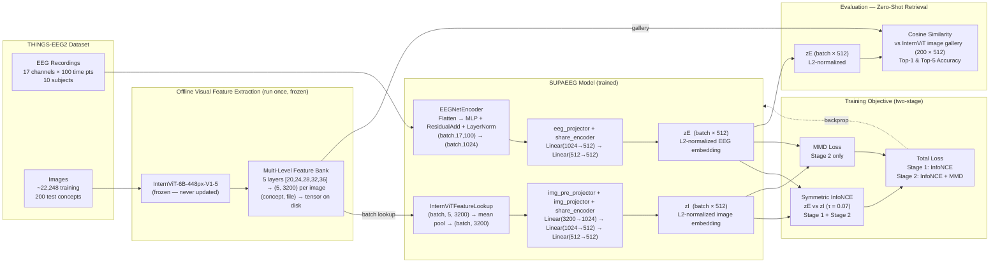
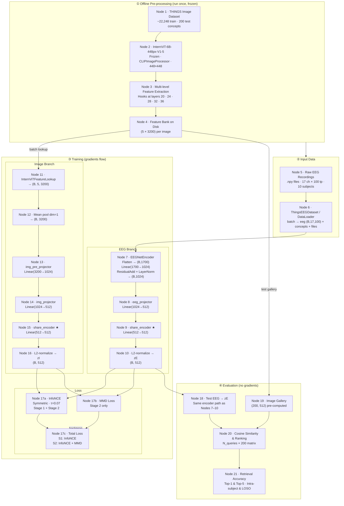

# SUPAEEG Pipeline Diagrams

Paste each code block into [mermaid.live](https://mermaid.live) to preview, then recreate in LucidChart.

**Two diagrams:**
- **Diagram 1** — high-level overview (LR, ~12 boxes). Good for a slide or README.
- **Diagram 2** — detailed LucidChart realization (TB overall, LR within Training). Matches the 21-node spec in `lucidchart_spec.md`; use this as the basis for the actual LucidChart build.

---

## Diagram 1 — High-Level Pipeline Overview

---

## Diagram 2 — Detailed LucidChart Realization (21 nodes)

Mirrors `lucidchart_spec.md` exactly. Stage labels = rectangular container boxes. Training container uses LR layout to show EEG and Image branches side-by-side. ★ = shared weights.

