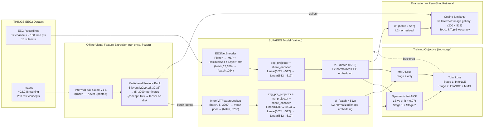

# SUPAEEG Pipeline Diagrams

Paste each code block into [mermaid.live](https://mermaid.live) to preview, then recreate in LucidChart.

---

## Diagram 1 — High-Level Pipeline Overview

```mermaid
flowchart LR
    subgraph DATA["THINGS-EEG2 Dataset"]
        direction TB
        EEG["EEG Recordings\n17 channels × 100 time pts\n10 subjects"]
        IMGS["Images\n~22,248 training\n200 test concepts"]
    end

    subgraph OFFLINE["Offline Visual Feature Extraction  (run once, frozen)"]
        direction TB
        INTERN["InternViT-6B-448px-V1-5\n(frozen — never updated)"]
        FEAT["Multi-Level Feature Bank\n5 layers [20,24,28,32,36] → (5, 3200) per image\n(concept, file) → tensor on disk"]
        IMGS --> INTERN --> FEAT
    end

    subgraph MODEL["SUPAEEG Model  (trained)"]
        direction TB
        NET["EEGNetEncoder\nFlatten → MLP + ResidualAdd + LayerNorm\n(batch,17,100) → (batch,1024)"]
        PROJ["eeg_projector + share_encoder\nLinear(1024→512) → Linear(512→512)"]
        ZE["zE  (batch × 512)\nL2-normalized EEG embedding"]
        EEG --> NET --> PROJ --> ZE

        LOOKUP["InternViTFeatureLookup\n(batch, 5, 3200) → mean pool → (batch, 3200)"]
        IPROJ["img_pre_projector + img_projector + share_encoder\nLinear(3200→1024) → Linear(1024→512) → Linear(512→512)"]
        ZI["zI  (batch × 512)\nL2-normalized image embedding"]
        FEAT -- "batch lookup" --> LOOKUP --> IPROJ --> ZI
    end

    subgraph LOSS["Training Objective  (two-stage)"]
        direction TB
        NCE["Symmetric InfoNCE\nzE vs zI  (τ = 0.07)\nStage 1 + Stage 2"]
        MMD["MMD Loss\nStage 2 only"]
        TOTAL["Total Loss\nStage 1: InfoNCE\nStage 2: InfoNCE + MMD"]
        NCE & MMD --> TOTAL
    end

    subgraph EVAL["Evaluation — Zero-Shot Retrieval"]
        direction TB
        EMB["zE  (batch × 512)\nL2-normalized"]
        RET["Cosine Similarity\nvs InternViT image gallery  (200 × 512)\nTop-1 & Top-5 Accuracy"]
        EMB --> RET
    end

    ZE --> NCE
    ZI --> NCE
    ZE --> MMD
    ZI --> MMD
    ZE --> EMB
    FEAT -- "gallery" --> RET
    TOTAL -.->|"backprop"| MODEL
```
